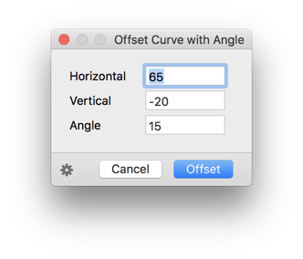

# OffsetCurveWithAngle

*Filter > Offset Curve with Angle* is a plugin for the [Glyphs font editor](http://glyphsapp.com/). It provides a simple curve offset with an angle.

### Installation

1. Go to *Window > Plugin Manager.*
2. Look for *Offset Curve with Angle*, and click the *Install* button next to it.
3. Restart Glyphs.

### Requirements

The plugin needs Glyphs 2.5 or higher, running on OS X 10.9 or later.

### License

Copyright 2018 Rainer Erich Scheichelbauer (@mekkablue).
Based on sample code by Georg Seifert (@schriftgestalt) and Jan Gerner (@yanone).

Licensed under the Apache License, Version 2.0 (the "License");
you may not use this file except in compliance with the License.
You may obtain a copy of the License at

http://www.apache.org/licenses/LICENSE-2.0

See the License file included in this repository for further details.
